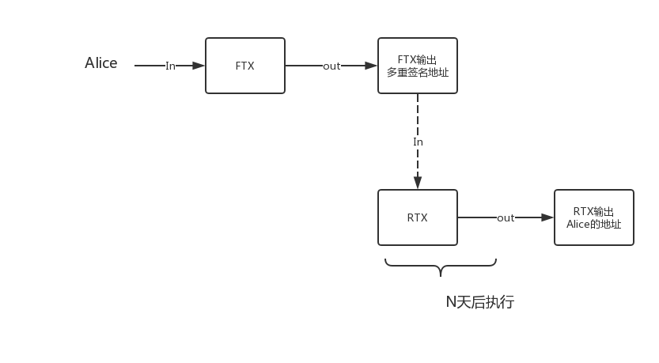
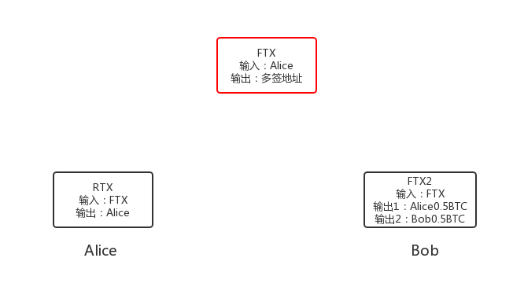
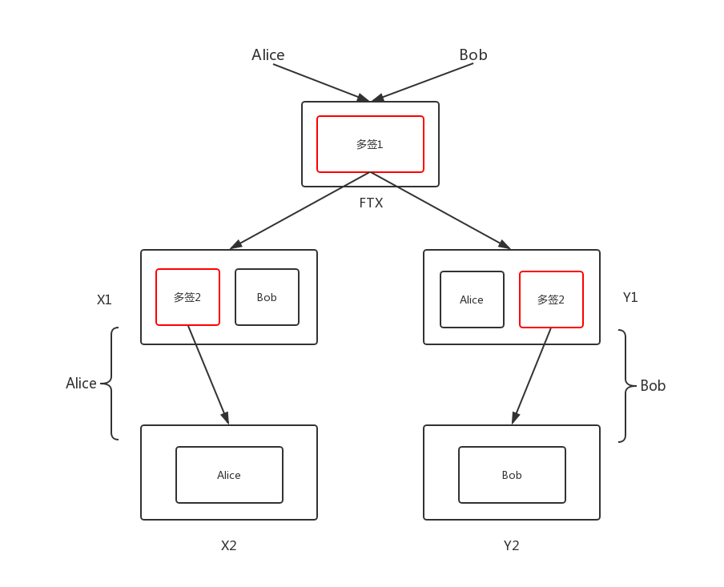
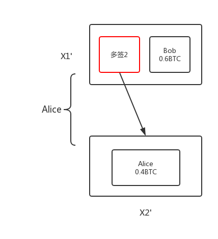
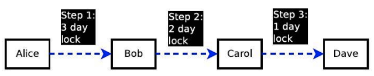
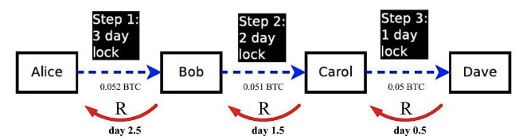

# 闪电网络概念与技术原理

## 引言

闪电网络最早是针对比特币链上处理交易速度慢而提出的链下支付技术，闪电网络的理念是将小额多频的交易放到链下完成，在链上仅记录最终的成交状态，这样就能提高比特币交易的处理速度。

## 预备知识

要了解闪电网络基本原理，你需要知道以下内容：
- 比特币交易的输入和输出
- 多重签名

### 比特币交易的输入和输出
比特币的交易是使用`UTXO`模型，即交易包含输入和输出，下一笔交易必须包含上一笔交易的输出才能被花出去。形象地比喻：如果Alice给Bob转一笔钱，那么就相当于Alice把钱放在了一个Bob才能打开的箱子里面，当Bob想要花掉这笔钱给Jack时，Bob打开箱子然后把钱封装在只有Jack才能打开的箱子里，以此类推。

### 多重签名
多重签名，顾名思义即多个签名，如果我们把Bob的签名比作打开箱子的钥匙的话，那么多重签名就相当于一把复杂的锁，这个锁可能需要Alice和Bob的两把钥匙才能打开。

## 微支付通道
我们以Alice和Bob之间的交易来解释微支付通道的原理。首先，我们介绍两种交易：
- FTX
- RTX

其中FTX指的是支付交易，即Alice向一个多重签名地址（需要Alice和Bob的签名的地址）发送N个比特币，例如1BTC。RTX是指Alice构造一个指向自己的交易，交易的输入是FTX的输出，并且该交易有锁定期（多少天之后触发）详细情况如下图所示：

在这基础上，Alice就可以和Bob一些不超过1BTC的支付了：假设Alice在Bob的商铺买了一个iphone花掉0.5BTC，为了给BTC转这笔钱，ALice这样做：

- 首先ALice把之前构造好的RTX发送给Bob，Bob进行签名并发送给Alice
- Alice拿到Bob签名好的RTX，广播FTX
- Alice构造另一笔交易FTX2，两个输出，分别为Alice 0.5BTC和Bob 0.5BTC
- ALice将FTX2签名并发给Bob
- Bob如果接受，就签名这笔交易

注意到上面的步骤，只广播了一次交易FTX，这就代表，只有这条交易被上链。而购买iphone的交易，Bob并没有广播。现在我们看看Alice和Bob手里有哪些可以拿到钱的证据：

Alice有一个Bob签了名的RTX，输入为FTX，输出为Alice这意味着Alice可以拿到FTX中所有的钱。Bob手里有一个Alice支付给他的0.5BTC的FTX2，这意味着Bob可以从FTX中拿到0.5BTC。所以对Bob来讲，必须在Alice广播RTX前把FTX2广播出去，这样才能不受到损失：

上面的图中已经很清楚地解释了当前的现状，注意：引用FTX的交易都需要双方的多重签名。在RTX没有执行之前，Alice和Bob可以创建无数个这样的微交易，对于Bob来说，只要在最后时刻前把最后的FTXN广播出去，就不会受到任何损失。当交易执行完毕后，支付通道关闭，这就是微支付通道的基本原理。整个过程中，不管Alice和Bob之间发生多少比交易，最终上链的只有三比交易，大大减少了比特币系统处理交易的次数。

## RSMC
尽管微支付通道很强大，但是我们也发现其中的缺点：资金只能单向流通，即Alice不断地支付给Bob，但Bob却不能支付给Alice（思考下就会明白，如果任何一方抵赖，他们将会存在冲突），而RSMC就是解决这个问题的。

我们再来看看Alice和Bob如何通过RSMC进行线下双向支付：
>注：多签1即Alice和Bob的签名地址，多签2如果是Alice创建那么为Alice2和Bob的签名地址，否则为Bob2和Alice的签名地址

- 双方各拿出0.5BTC，建立FTX，输出为多重签名1地址
- Alice和Bob分别创建两个交易X1和Y1，输入都为FTX，输出为多签2和对方的地址（0.5BTC）
- 接着创建X2和Y2，输入为X1和Y1的多签，输出为自己的地址（0.5BTC）

注意上图中红色的输出是需要双方同意的，由于是对称的，我们只看Alice这边，对于Alice来说，要想拿到0.5BTC，必须签名X1，这样Bob就也能拿到0.5BTC。此时对于Bob来说，要想拿到0.5BTC就必须签署X1，这样Alice也就能拿到她的0.5BTC。所以在这种情况下双方没办法作恶。

### 支付更新
下面来看看Alice给Bob付款0.1BTC会怎么做：付款后的结果应该是Alice0.4BTC，Bob0.6BTC，因此Alice创建X1'和X2':

和上面的类似，但是存在一个问题是如何废弃之前的X1和X2呢？注意到X1的多签是Alice2的私钥，如果Alice把Alice2的私钥给Bob即代表Alice废弃了该交易，这样Bob就可以任意修改X1的输出。

此外，为了防止Alice先把X1交易广播从而给Bob带来损失，RSMC会有一个惩罚机制，允许Bob提供Alice违约的证据，一旦判定Alice违约，Alice的币将全部归Bob所有。其中X1和Y1的交易中含有sequence字段，确保其延期进块，目的就是为了防止作恶情况发生，以便处理惩罚交易。

## HTLC
HTLC是哈希时间锁定合约，目的是用来解决跨节点交易的。上面我们讲的都是Alice和Bob之间的交易，并且Alice和Bob已经存在了支付通道，但是如果Alice想给Jack转账却没有支付通道该怎么办？

如果这时Bob和Jack有支付通道，Alice就可以通过Bob来“传递这笔钱”，相应的Bob会获得一些劳务费。下面通过这张图来解释Alice如何与Dave完成链下支付：

Alice想给Dave转账1BTC，找到了Alice->Bob->Carol->Dave这个支付通道，首先Daves生成一个密钥R，并且将Hash(R)发送给Alice，Alice和Bob签订一个HTLC合约：只要Bob在3天内给Alice正确的R，那么Alice给Bob1.2BTC。同理，Bob和Carol约定一个2天的1.1BTC的HTLC合约，Carol和Dave约定一个1一天的1BTC的合约。

由于是Alice付款给Dave，因此Dave会尽快给Caraol密钥R以便获得1BTC，而Carol为了获得1.1BTC，他会尽快给Bob密钥R，同理，最后Bob把密钥给了Alice，Alice支付给Bob1.3BTC（0.3BTC相当于整个支付过程的手续费）并完成了与Dave的跨节点链下交易。

